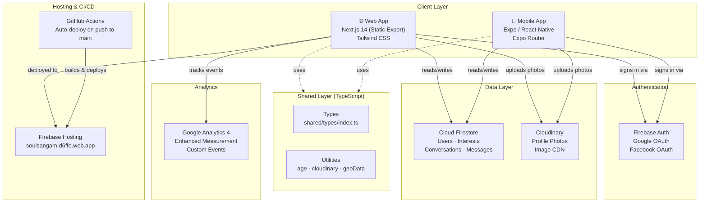
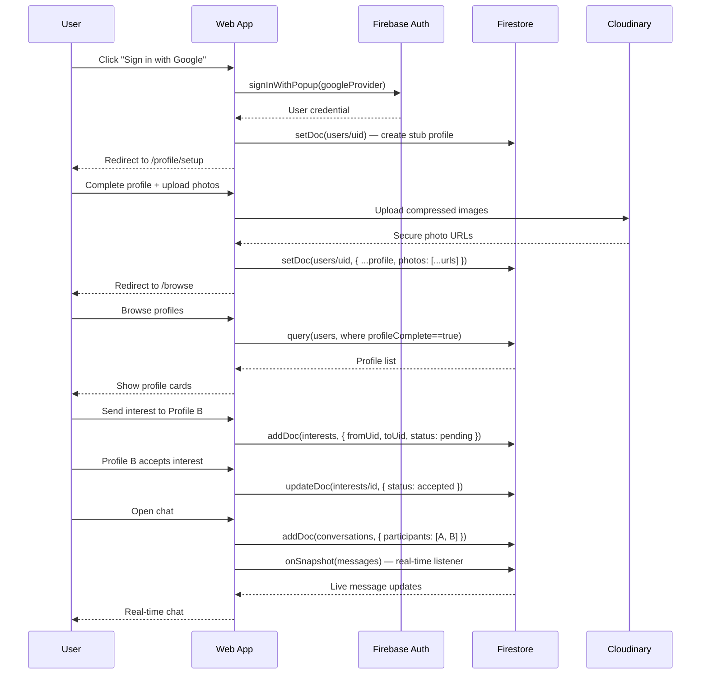

# Familiara — Matrimonial Web & Mobile App

A full-stack matrimonial platform built with **Next.js 14** (web), **Expo / React Native** (mobile), and **Firebase** as the backend — all on the free tier.

---

## Architecture



---

## Data Flow



---

## Project Structure

```
familiara/
├── .github/
│   └── workflows/
│       ├── deploy.yml          # Build + deploy to Firebase on push to main
│       └── preview.yml         # Preview deploy on pull requests
│
├── shared/                     # Shared across web and mobile
│   ├── firebase/
│   │   └── config.ts           # Firebase app initialisation (web)
│   ├── types/
│   │   └── index.ts            # TypeScript interfaces (UserProfile, Interest, Message…)
│   └── utils/
│       ├── age.ts              # Age / height helpers
│       └── cloudinary.ts       # Cloudinary upload utility
│
├── web/                        # Next.js 14 web app
│   ├── src/
│   │   ├── app/
│   │   │   ├── page.tsx                    # Landing page
│   │   │   ├── layout.tsx                  # Root layout + GA4 scripts
│   │   │   ├── globals.css                 # Tailwind + design tokens
│   │   │   ├── (auth)/login/               # Login page
│   │   │   └── (main)/
│   │   │       ├── layout.tsx              # Authenticated layout + nav
│   │   │       ├── browse/                 # Profile search & discovery
│   │   │       ├── matches/                # Interests sent/received/accepted
│   │   │       ├── chat/                   # Conversation list + real-time chat
│   │   │       └── profile/
│   │   │           ├── setup/              # 5-step profile creation wizard
│   │   │           ├── edit/               # Edit existing profile
│   │   │           └── view/               # View any profile
│   │   ├── components/
│   │   │   ├── profile/
│   │   │   │   ├── ProfileCard.tsx         # Browse grid card with quick-interest
│   │   │   │   ├── InterestButton.tsx      # Send/accept/decline interest
│   │   │   │   └── PhotoUploader.tsx       # Drag-reorder photo uploader
│   │   │   └── ui/
│   │   │       ├── FloatingSymbols.tsx     # Animated background on setup page
│   │   │       ├── MobileAppBanner.tsx     # "Install app" banner for mobile browsers
│   │   │       └── PageViewTracker.tsx     # GA4 SPA page view tracking
│   │   ├── context/
│   │   │   └── AuthContext.tsx             # Auth state + sign-in/out + refreshProfile
│   │   ├── hooks/
│   │   │   └── useRequireAuth.ts           # Route guard hook
│   │   └── lib/
│   │       ├── firebase.ts                 # Firebase init (inside Next.js for env inlining)
│   │       ├── analytics.ts                # GA4 event helpers
│   │       ├── geoData.ts                  # Country / state / city data
│   │       └── imageCompress.ts            # Client-side image compression (canvas)
│   ├── next.config.mjs
│   ├── tailwind.config.ts
│   └── package.json
│
├── mobile/                     # Expo React Native app
│   ├── app/
│   │   ├── _layout.tsx                     # Root layout + AuthProvider
│   │   ├── index.tsx                       # Auth redirect
│   │   ├── (auth)/login.tsx                # Login screen
│   │   ├── (tabs)/                         # Bottom tab navigator
│   │   │   ├── browse.tsx
│   │   │   ├── matches.tsx
│   │   │   ├── chat.tsx
│   │   │   └── profile.tsx
│   │   ├── profile/setup.tsx               # Profile setup wizard
│   │   └── chat/[convId].tsx               # Conversation screen
│   ├── src/
│   │   ├── components/
│   │   │   ├── profile/ProfileCard.tsx
│   │   │   ├── profile/PhotoUploader.tsx   # expo-image-picker + Cloudinary
│   │   │   └── ui/ Button · Input
│   │   ├── constants/theme.ts              # Design tokens
│   │   ├── context/AuthContext.tsx         # Native Google/Facebook auth
│   │   └── lib/firebase.ts                 # Firebase with AsyncStorage persistence
│   ├── app.json
│   └── package.json
│
├── firestore/
│   ├── firestore.rules                     # Security rules
│   ├── firestore.indexes.json              # Composite indexes
│   └── storage.rules
│
├── firebase.json                           # Firebase project config
├── .firebaserc                             # Project alias
└── README.md
```

---

## Tech Stack

| Layer | Technology | Purpose |
|---|---|---|
| Web frontend | Next.js 14 (App Router, Static Export) | Web application |
| Mobile | Expo 51 + React Native + Expo Router | iOS & Android app |
| Styling | Tailwind CSS | Design system |
| Auth | Firebase Authentication | Google + Facebook OAuth |
| Database | Cloud Firestore | All app data |
| File storage | Cloudinary (free tier) | Profile photos |
| Hosting | Firebase Hosting | Web deployment |
| CI/CD | GitHub Actions | Auto-deploy on push |
| Analytics | Google Analytics 4 | User behaviour tracking |
| Language | TypeScript | Throughout |

---

## Firestore Data Model

```
users/{uid}
  ├── uid, displayName, email, photoURL
  ├── photos: string[]           — Cloudinary URLs
  ├── gender, dateOfBirth, age, height
  ├── maritalStatus, religion, caste, motherTongue
  ├── nationality, location: { city, state, country }
  ├── education, occupation, annualIncome
  ├── bio, hobbies: string[]
  ├── preferences: { ageMin, ageMax, religions[], locations[] }
  ├── profileVisible: bool
  ├── profileComplete: bool
  └── verified: bool

interests/{id}
  ├── fromUid, toUid
  ├── status: "pending" | "accepted" | "declined"
  └── createdAt, updatedAt

conversations/{id}
  ├── participants: [uid1, uid2]
  ├── lastMessage, lastMessageAt
  ├── unreadCount: { [uid]: number }
  └── messages/{msgId}
        ├── senderUid, text
        ├── createdAt, read: bool
        └── convId

notifications/{id}
  ├── uid, type, fromUid
  ├── read: bool
  └── createdAt
```

---

## Getting Started

### Prerequisites

| Tool | Version |
|---|---|
| Node.js | 20+ |
| npm | 10+ |
| Firebase CLI | `npm i -g firebase-tools` |
| Expo CLI | `npm i -g expo-cli` |

### 1 — Clone & install

```bash
git clone https://github.com/CompressLab/soul-sangam.git familiara
cd familiara

# Install root deps (shared Firebase package)
npm install

# Install web deps
cd web && npm install && cd ..
```

### 2 — Configure environment

```bash
cp web/.env.local.example web/.env.local
```

Fill in `web/.env.local` with values from Firebase Console → Project Settings → Your Apps:

```env
NEXT_PUBLIC_FIREBASE_API_KEY=
NEXT_PUBLIC_FIREBASE_AUTH_DOMAIN=soulsangam-d6ffe.firebaseapp.com
NEXT_PUBLIC_FIREBASE_PROJECT_ID=soulsangam-d6ffe
NEXT_PUBLIC_FIREBASE_STORAGE_BUCKET=soulsangam-d6ffe.firebasestorage.app
NEXT_PUBLIC_FIREBASE_MESSAGING_SENDER_ID=
NEXT_PUBLIC_FIREBASE_APP_ID=
NEXT_PUBLIC_FIREBASE_MEASUREMENT_ID=G-EMG3X7R6BQ
NEXT_PUBLIC_CLOUDINARY_CLOUD_NAME=d7epboym
NEXT_PUBLIC_CLOUDINARY_UPLOAD_PRESET=matrimonial_profiles
```

### 3 — Run the web app locally

```bash
cd web
npm run dev
# Open http://localhost:3000
```

### 4 — Deploy Firestore rules

```bash
firebase login
firebase use soulsangam-d6ffe
firebase deploy --only firestore
```

### 5 — Deploy to Firebase Hosting (CI/CD)

Push to `main` — GitHub Actions handles the build and deploy automatically.

Required GitHub Secrets (repo → Settings → Secrets → Actions):

| Secret | Value |
|---|---|
| `FIREBASE_API_KEY` | From Firebase config |
| `FIREBASE_AUTH_DOMAIN` | `soulsangam-d6ffe.firebaseapp.com` |
| `FIREBASE_PROJECT_ID` | `soulsangam-d6ffe` |
| `FIREBASE_STORAGE_BUCKET` | `soulsangam-d6ffe.firebasestorage.app` |
| `FIREBASE_MESSAGING_SENDER_ID` | From Firebase config |
| `FIREBASE_APP_ID` | From Firebase config |
| `FIREBASE_MEASUREMENT_ID` | `G-EMG3X7R6BQ` |
| `CLOUDINARY_CLOUD_NAME` | `d7epboym` |
| `CLOUDINARY_UPLOAD_PRESET` | `matrimonial_profiles` |
| `FIREBASE_SERVICE_ACCOUNT` | JSON from Firebase → Service Accounts |

---

## Key Features

| Feature | Web | Mobile |
|---|---|---|
| Google + Facebook Sign-In | ✅ | ✅ |
| 5-step profile wizard | ✅ | ✅ |
| Country/State/City dropdowns | ✅ | — |
| Image compression + upload | ✅ | ✅ |
| Browse & filter profiles | ✅ | ✅ |
| Send / Accept / Decline interest | ✅ | ✅ |
| Real-time chat | ✅ | ✅ |
| Profile edit | ✅ | — |
| Animated background (setup) | ✅ | — |
| Mobile install banner | ✅ | — |
| GA4 analytics | ✅ | — |
| Firestore security rules | ✅ | ✅ |

---

## Live App

**Web:** [https://soulsangam-d6ffe.web.app](https://soulsangam-d6ffe.web.app)

---

## Free Tier Limits

| Service | Free Allowance |
|---|---|
| Firebase Auth | Unlimited |
| Firestore reads | 50,000 / day |
| Firestore writes | 20,000 / day |
| Cloudinary storage | 25 GB |
| Cloudinary bandwidth | 25 GB / month |
| Firebase Hosting | 10 GB / month |
| GitHub Actions | 2,000 min / month |
